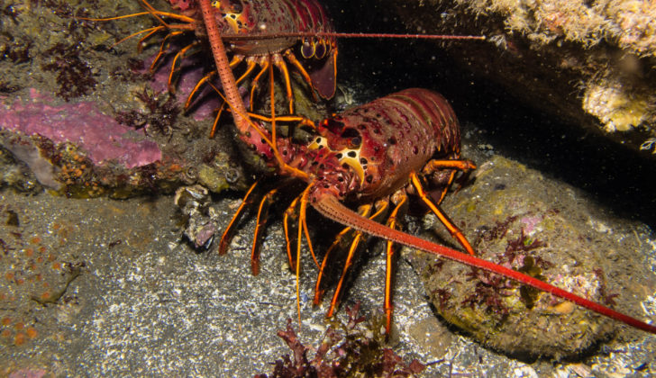

```{r setup, include=FALSE}
knitr::opts_chunk$set(echo = FALSE,
                      message = FALSE,
                      warning = FALSE)
```

### **Introduction**

Off the coast of Santa Barbara live an abundance of California Spiny Lobsters.  These lobsters are harvested in great numbers for human consumption.  It is important to analyze how anthropogenic factors effect lobster abundance.  In 2012, California introduced the "Marine Protected Area" (MPA) law to help preserve critical ecosystems.  

{width=700px}
**(Figure 1)** *California Spiny Lobster (Credit: [Ed Bierman] (https://www.nationalfisherman.com/west-coast-pacific/pacific-lobster-harvest-expected-to-bounce-back-but-prices-lull/))*

In Santa Barbara, two sites, Naples and Isla Vista are listed as marine protected areas.  Do these areas help to protect critical fauna such as the California Spiny Lobster? In this report, we will analyze the effect of MPAs on California Spiny Lobster abundance between 2012 through 2018.  By looking at factors such as abundance, density, and size over these protected and non-protected sites we will determine whether MPA status has a significant effect on lobster abundance and size over the 2012-2018 period.  

[width=700px]
**(Figure 2)** *The MPA and non-MPA locations {left to right - Arroyo Quemado, Naples, Isla Vista, Mohawk, Carpenteria} Credit: SBC LTER- ([EDI Data Portal](https://portal.edirepository.org/nis/mapbrowse?scope=knb-lter-sbc&identifier=77&revision=newest))*

### **Data & Methods**


  SBC LTER collected and provided data on California Spiny Lobster’s along the mainland coast of the Santa Barbara channel between 2012 and 2018.  Abundance and size data was collected annually by divers in late summer before the start of the fishing season at five SBC LTER long term kelp forest study sites: two within MPAs (Naples and Isla Vista) and three outside (Arroyo Quemado, Mohawk and Carpinteria).   


  Lobster abundance was compared using total number of lobster observations (lobster count by site) across all years of the study (2012-2018).  Lobster size distributions were compared using lobster measurements (in mm) across samples taken at all study sites in both 2012 and 2018.  Mean lobster size in MPA versus non-MPA sites was compared through a two-sample t-test at a 95% confidence level in 2012, 2018, and both 2012 and 2018. Effect size was compared using Cohen's d.


  For more information concerning data and methods used by SBC LTER, see [Metadata](https://portal.edirepository.org/nis/metadataviewer?packageid=knb-lter-sbc.77.3)


### **Results**

```{r}

# Attach packages

library(tidyverse)
library(janitor)
library(directlabels)
library(here)
library(kableExtra)
library(effsize)

```


```{r}

# Read in and clean the data

lobster_data <- read_csv(("lobster_abundance_sbc_lter.csv"),
                         na = "-99999") %>%
  clean_names()

lobster_tidy <- lobster_data %>%
  uncount(count)

```


```{r}

# Manipulate the data to get lobster count per year for each site

lobster_count <- lobster_data %>%
  group_by(year, site) %>%
  summarize(
    total_count_by_site = sum(count, na.rm = TRUE)
  ) %>%
  mutate(mpa = case_when(
    site %in% c("IVEE", "NAPL") ~ "Marine Protected Area",
    site %in% c("MOHK", "CARP", "AQUE") ~ "Non Marine Protected Area"
  )) %>%
  mutate(site_name = case_when(
    site == "MOHK" ~ "Mohawk",
    site == "CARP" ~ "Carpinteria",
    site == "AQUE" ~ "Arroyo Quemada",
    site == "NAPL" ~ "Naples",
    site == "IVEE" ~ "Isla Vista"
  ))

```


```{r}

# Create a variable to differentiate MPA from non-MPA sites

mpa_color <- c("Marine Protected Area" = "purple2", "Non Marine Protected Area" = "limegreen")

```

#### 1. Changes in lobster abundance by year and location
First, we will look at how sample lobster counts have changed between 2012 and 2018.  We will look to see if there are any trends; specifically, we are curious to see whether or not location, year, and Marine Protected Area status will have an effect on lobster abundance.  

```{r}

# Graph lobster count by area for the years 2012-2018

ggplot(data = lobster_count, aes(x = year, y = total_count_by_site)) +
  geom_line(aes(color = mpa),
            size = 1,
            show.legend = TRUE) +
  geom_point(size = 1) +
  scale_color_manual(values = mpa_color) +
  scale_x_continuous(expand = c(0,0),
                     limits = c(2011.6, 2018.4),
                     breaks = seq(2012, 2018, by = 1)) +
  scale_y_continuous(expand = c(0,0),
                     limits = c(0,1000),
                     breaks = seq(0, 1000, by = 125)) +
  facet_wrap(~site_name,
             nrow = 2,
             scales = "free_x") +
  labs(
    x = "Year",
    y = "Lobster Count",
    title = "Santa Barbara Lobster Counts by Year (2012-2018)",
    caption = "(Figure 3). Annual lobster counts for 5 different sampling locations from 2012 to 2018.  In purple, Marine Protected Areas \nare shown (Isla Vista and Naples), and in lime green non-Marine Protected Areas are shown. \nData: SBC LTER."
  ) +
  theme_bw() +
  theme(legend.position = c(.837,.25),
        legend.text = element_text(size =10),
        legend.title = element_blank(),
        plot.title = element_text(size = 17),
        axis.title = element_text(size =15),
        axis.text.x = element_text(angle =90),
        strip.text.x = element_text(size =13))
       
```

  When looking at the data in Figure 3, we notice some interesting trends.  Between 2016 and 2017 at two sites, Carpenteria and Isla Vista, drastic spikes in lobster abundance are apparent.  Interestingly enough, one of the sites is in a marine protected area site (Isla Vista), while the other (Carpenteria) is not.  From 2017 and on, in both MPA protected sites (Isla Vista and Naples), we can see an increase in lobster count; this goes along with the goal of the MPA - to help populations replenish.  
  
  In other years there are no noticeable trends.  For Mohawk, there was a spike in lobster count between 2014 to 2015, but in other non-MPA sites we do not see a similar spike.  It would be useful to have data on specific ocean conditions and events for each area to determine how other factors may be sparking these changes; although MPA status may help California Spiny Lobster populations, other factors are most likely coming into play causing irregular shifts in population levels.  

  Again, looking at the data, there is no indication that MPA status has any noticable effect on lobster abundance when comparing it to non-MPA sites. While MPA status may prove to be an effective tool for managing California Spiny Lobster populations, it could be that other factors are having an effect on abundance from year to year.  Factors such as levels of fishing pressure and ocean conditions could be playing an unseen role in lobster abundance differences between the different MPA and non-MPA sites.  

#Results B

```{r}

lobster_results_mpa <- lobster_data %>% 
  select(year, site, size_mm) %>% 
  filter(year %in% c(2012, 2018)) %>% 
  filter(site %in% c("NAPL", "IVEE")) %>% 
   mutate(year = as.character(year))


lobster_results_mpa$site[lobster_results_mpa$site == "IVEE"] <-  "Isla Vista"

lobster_results_mpa$site[lobster_results_mpa$site == "NAPL"] <- "Naples"

ggplot(data = lobster_results_mpa, aes(x = size_mm, fill = year)) +
  geom_density(alpha = 0.5) +
  facet_wrap(~site) +
  theme_minimal() +
  labs(title = "Lobster Size Distribution in MPA Sites 2012, 2018", x = "Size (mm)", y = "Relative Frequency", 
   caption = "(Figure 5). Lobster Size Distribution in MPA protected sites in 2012 and 2018. The red curve shows \nlobster samples collected in 2012 while the blue curve shows lobster samples collected in 2018.\n Data: SBC LTER.") + scale_x_continuous(limits = c(40, 160),
                     breaks = seq(40, 160, by = 40)) +
scale_y_continuous(limits = c(0, 0.06),
                     breaks = seq(0, 0.06, by = 0.01))


lobster_results_not_mpa <- lobster_data %>% 
  select(year, site, size_mm) %>% 
  filter(year %in% c(2012, 2018)) %>% 
  filter(site %in% c("AQUE", "MOHK", "CARP")) %>% 
   mutate(year = as.character(year))

lobster_results_not_mpa$site[lobster_results_not_mpa$site == "AQUE"] <- "Arroyo Quemada"

lobster_results_not_mpa$site[lobster_results_not_mpa$site == "CARP"] <- "Carpinteria"

lobster_results_not_mpa$site[lobster_results_not_mpa$site == "MOHK"] <- "Mohawk"

ggplot(data = lobster_results_not_mpa, aes(x = size_mm, fill = year)) +
  geom_density(alpha = 0.5) +
  facet_wrap(~site) +
  theme_minimal() +
  labs(title = "Lobster Size Distribution in non-MPA Sites 2012, 2018", x = "Size (mm)", y = "Relative Frequency",
         caption = "(Figure 5). Lobster Size Distribution in non-MPA protected sites in 2012 and 2018. The red curve shows \nlobster samples collected in 2012 while the blue curve shows lobster samples collected in 2018.\n Data: SBC LTER.") +
   scale_x_continuous(limits = c(40, 160),
                     breaks = seq(40, 160, by = 40)) +
  scale_y_continuous(limits = c(0, 0.06),
                     breaks = seq(0, 0.06, by = 0.01))

  
  
  
```


  Some interesting trends are immediately noticed in MPA sites when comparing 2012 size and density to 2018 size and density (Isla Vista and Naples).  Average overall lobster size is shown to have increased for both MPA sites.  Within non-MPA sites, we notice littel change within lobster size and density.  Drastic changes from the mean in 2012 to 2018 within MPA sites illustrate that by designating a site as a Marine Protected Area, it is possible to increase the health of local lobster populations; in this case, it seems to have aided in the increase of average size within the populations. 


```{r}
# Add mpa column to data sheet

lobster_b <- lobster_data %>% 
  select(year, site, size_mm) %>%
  filter(year %in% c(2012, 2018)) %>% 
   mutate(year = as.character(year)) %>% 
mutate(site_name = case_when(
    site == "MOHK" ~ "Mohawk",
    site == "CARP" ~ "Carpinteria",
    site == "AQUE" ~ "Arroyo Quemada",
    site == "NAPL" ~ "Naples",
    site == "IVEE" ~ "Isla Vista"
  ))

mpa_lobster <- lobster_b %>% 
  mutate(mpa = case_when(site_name %in% c("Naples", "Isla Vista") ~ "mpa",
                       site_name %in% c("Carpinteria", "Arroyo Quemada", "Mohawk") ~ "not_mpa"))

```


```{r}
# Compare summary statistics between 2012 and 2018 for MPA and not MPA


summary_stats <- mpa_lobster %>% 
  group_by(mpa, year) %>% 
  summarize(mean = mean(size_mm, na.rm = TRUE),
  sd = sd(size_mm, na.rm = TRUE),
  sample = n())
  

lobster_summary_table <- summary_stats %>% 
  kable(col.names = c("Year", 
                     "MPA or non-MPA Sites", 
                     "Mean lobster size (mm)",
                     "Standard Deviation (mm)",
                     "Sample Size (# of lobsters)"),
        caption = "Figure 5. Lobster size sample statistics grouped in MPA and non-MPA sites in 2012 and 2018."
        ) %>% 
  kable_styling(bootstrap_options = c("striped", "bordered"),
                full_width = F,
                position = "center") 

```

#2012 difference between MPA and non-MPA sizes

```{r}
lobster_2012_mpa <- mpa_lobster %>% 
  filter(year == "2012", mpa == "mpa") %>% 
  pull(size_mm)

lobster_2012_not_mpa <- mpa_lobster %>% 
  filter(year == "2012", mpa == "not_mpa") %>% 
  pull(size_mm)

 `2012_ttest` <- t.test(lobster_2012_mpa, lobster_2012_not_mpa)
 
 `2012_ttest`

 cohen_2012 <- effsize::cohen.d(lobster_2012_mpa, lobster_2012_not_mpa, na.rm = TRUE)

cohen_2012
```

Upon comparing the mean sizes 


#2018 difference between MPA and non-MPA sizes

```{r}

lobster_2018_mpa <- mpa_lobster %>% 
  filter(year == "2018", mpa == "mpa") %>% 
  pull(size_mm)

lobster_2018_not_mpa <- mpa_lobster %>% 
  filter(year == "2018", mpa == "not_mpa") %>% 
  pull(size_mm)

 `2018_ttest` <- t.test(lobster_2018_mpa, lobster_2018_not_mpa)
 
 `2018_ttest`
 
 cohen_2018 <- effsize::cohen.d(lobster_2018_mpa, lobster_2018_not_mpa, na.rm = TRUE)

cohen_2018

```

#MPA sites between 2012 and 2018

```{r}


 `mpa_ttest` <- t.test(lobster_2012_mpa, lobster_2018_mpa)
 
 `mpa_ttest`
 
 cohen_mpa <- effsize::cohen.d(lobster_2012_mpa, lobster_2018_mpa, na.rm = TRUE)

cohen_mpa


```

#non MPA sites between 2012 and 2018

```{r}
`non_mpa_ttest` <- t.test(lobster_2012_not_mpa, lobster_2018_not_mpa)

`non_mpa_ttest`

cohen_not_mpa <- effsize::cohen.d(lobster_2012_not_mpa, lobster_2018_not_mpa, na.rm = TRUE)

cohen_not_mpa

```


